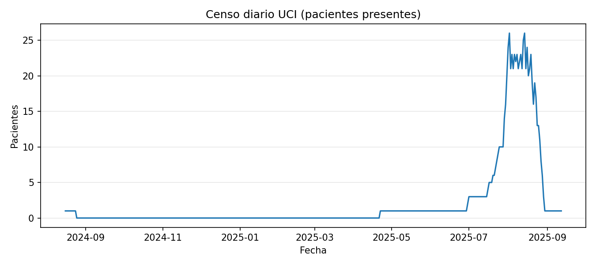
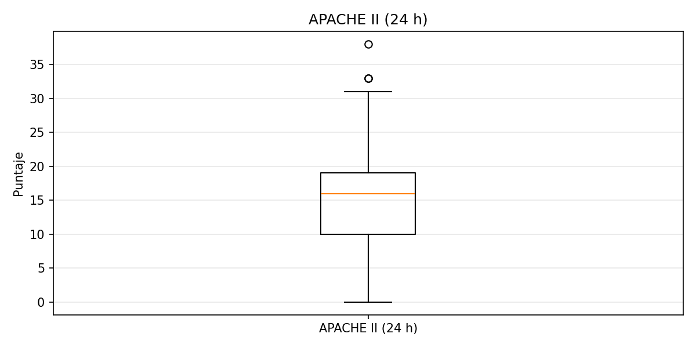

<link rel="stylesheet" href="assets/report.css">

<h1>Informe Operativo UCI</h1>

Actualizado: 2025-09-18 22:41 UTCPeríodo: 2024-08-16 → 2025-08-29

<a href="#resumen-ejecutivo">Resumen</a>
<a href="#dinamica-asistencial">Dinámica</a>
<a href="#severidad-y-estancia">Severidad</a>
<a href="#vigilancia-microbiologica">KPC/MBL</a>
<a href="#casuistica-top">Casuística</a>

<h2 id="resumen-ejecutivo">Resumen ejecutivo</h2>

Admisiones

91

Egresos

90

Óbitos

19

Mort./egresos 21.1% · Mort./adm 20.9%

Vent. invasiva

41.8%

LOS mediana

4.0 d

Q1 2.0 – Q3 9.0 · media 8.1

APACHE II 24 h

16.0

Q1 10.0 – Q3 19.0

SOFA 48 h

5.0

Q1 2.0 – Q3 8.0

Dispositivos/100 adm

96.7 CVC

HD 15.4 · Líneas 27.5 · ECG/pt 1.70

<h2 id="dinamica-asistencial">Dinámica asistencial</h2>

<figure><figcaption>Admisiones y egresos diarios</figcaption></figure>

<figure><figcaption>Censo diario UCI</figcaption></figure>

<h2 id="severidad-y-estancia">Severidad y estancia</h2>

<figure><figcaption>Distribución de LOS (días)</figcaption></figure>

<figure><figcaption>APACHE II a 24 h</figcaption></figure>

<figure><figcaption>SOFA a 48 h</figcaption></figure>

<h2 id="vigilancia-microbiologica">Vigilancia microbiológica</h2>

<figure><figcaption>Distribución por estado KPC/MBL</figcaption></figure>

<h2 id="casuistica-top">Casuística (Top)</h2>

<figure><figcaption>Pacientes por origen (Top 8)</figcaption></figure>

<h3>Por médico tratante</h3>

| Médico | Casos | Óbitos | Mort.% | LOS_med | APACHE_med | SOFA48_med |
|---|---|---|---|---|---|---|
| 3 Dra Alejandra Ramirez | 25 | 4 | 16.0% | 3.0 | 18.0 | 5.0 |
| 5 Dr Rodney Recalde | 17 | 4 | 23.5% | 4.0 | 12.0 | 4.0 |
| 4 Dra Jazmin Cáceres | 21 | 3 | 15.0% | 3.0 | 15.0 | 3.0 |
| 6 Dr Pablo Rolon | 11 | 3 | 27.3% | 9.0 | 10.0 | 3.0 |
| 1 Dr Oscar Gómez | 7 | 3 | 42.9% | 30.0 | 14.0 | 8.0 |
| 2 Dr Rubén Goto | 10 | 2 | 20.0% | 5.0 | 17.5 | 5.5 |

<h3>Por origen del paciente (Top 10)</h3>

| Origen | Casos | Óbitos | Mort.% | LOS_med |
|---|---|---|---|---|
| Reanimación | 26 | 11 | 42.3% | 10.0 |
| Traumatología | 23 | 3 | 13.6% | 3.0 |
| Cx Gral Piso | 20 | 1 | 5.0% | 3.0 |
| Neurocx | 8 | 0 | 0.0% | 2.5 |
| Clínica Médica | 4 | 1 | 25.0% | 5.0 |
| Cx Gral Urgencias | 4 | 3 | 75.0% | 5.0 |
| Urología | 2 | 0 | 0.0% | 4.5 |
| Coloproctología | 1 | 0 | 0.0% | 2.0 |
| IPS Interior | 1 | 0 | 0.0% | 102.0 |
| Mastología | 1 | 0 | 0.0% | 2.0 |

<h3>Por tipo de paciente (Top 10)</h3>

| Tipo | Casos | Óbitos | Mort.% | LOS_med |
|---|---|---|---|---|
| Neurocx Urgencias | 17 | 5 | 29.4% | 4.0 |
| Traumatología Programada | 14 | 1 | 7.7% | 3.0 |
| Cirugía Gral y especialidades Programada | 10 | 0 | 0.0% | 1.5 |
| Paciente Clínico | 9 | 6 | 66.7% | 10.0 |
| Paciente Qx con complicación Quirúrgica | 9 | 2 | 22.2% | 6.0 |
| Cirugía Gral y especialidades de Urgencias | 7 | 1 | 14.3% | 10.0 |
| Paciente Qx con complicación Clínica | 7 | 2 | 28.6% | 7.0 |
| Traumatología de Urgencias | 6 | 1 | 16.7% | 3.0 |
| Politrauma(Accidente moto, auto, arrollamiento peatón) | 5 | 1 | 20.0% | 9.0 |
| Neurocx Programada | 3 | 0 | 0.0% | 2.0 |

<h3>KPC/MBL</h3>

| Estado | Pacientes |
|---|---|
| Negativo | 44 |
| Pendiente HR ingreso | 34 |
| HR de Prevalencia | 6 |
| HR de Ingreso | 5 |
| Conocido portador MDR | 2 |

<strong>Notas metodológicas:</strong> Mortalidad sin ajuste por gravedad ni case-mix. El indicador “Mort./egresos” usa el número de egresos como denominador. LOS recalculado cuando faltan días en la hoja.

