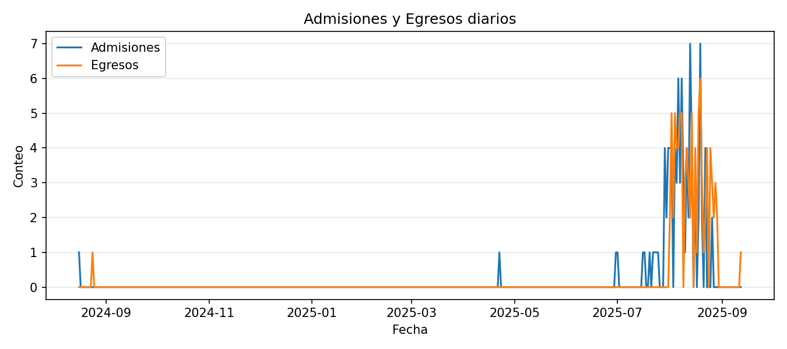
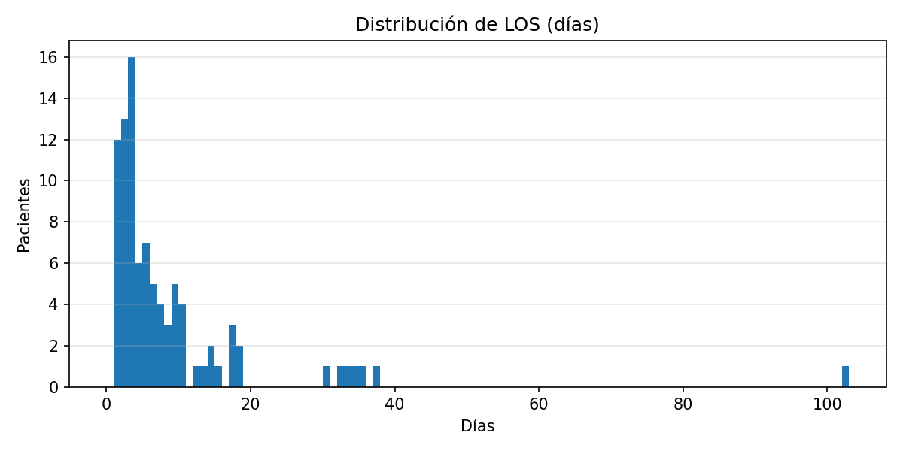

# Informe Operativo UCI

_Actualizado: 2025-09-18 22:24 (UTC)_

**Período:** 2024-08-16 → 2025-08-29

## Resumen ejecutivo

- **Admisiones:** 91
- **Egresos:** 90
- **Óbitos:** 19  ·  **Mortalidad/egresos:** 21.1%  ·  **Mortalidad/admisiones:** 20.9%
- **LOS (días):** mediana 4.0  (Q1 2.0 – Q3 9.0)  ·  media 8.1
- **APACHE II (24 h):** mediana 16.0  (Q1 10.0 – Q3 19.0)
- **SOFA 48 h:** mediana 5.0  (Q1 2.0 – Q3 8.0)
- **Ventilación invasiva:** 41.8% de los pacientes
- **Dispositivos/100 adm.:** CVC 96.7 · HD 15.4 · Líneas art. 27.5 · ECG/paciente 1.70

## Dinámica asistencial

## Severidad y estancia

## Vigilancia microbiológica

## Casuística (Top)

### Por médico tratante
| Médico | Casos | Óbitos | Mort.% | LOS_med | APACHE_med | SOFA48_med |
|---|---|---|---|---|---|---|
| 3 Dra Alejandra Ramirez | 25 | 4 | 16.0 | 3.0 | 18.0 | 5.0 |
| 5 Dr Rodney Recalde | 17 | 4 | 23.52941176470588 | 4.0 | 12.0 | 4.0 |
| 4 Dra Jazmin Cáceres | 21 | 3 | 15.0 | 3.0 | 15.0 | 3.0 |
| 6 Dr Pablo Rolon | 11 | 3 | 27.27272727272727 | 9.0 | 10.0 | 3.0 |
| 1 Dr Oscar Gómez | 7 | 3 | 42.857142857142854 | 30.0 | 14.0 | 8.0 |
| 2 Dr Rubén Goto | 10 | 2 | 20.0 | 5.0 | 17.5 | 5.5 |

### Por origen del paciente (Top 10)
| Origen | Casos | Óbitos | Mort.% | LOS_med |
|---|---|---|---|---|
| Reanimación | 26 | 11 | 42.30769230769231 | 10.0 |
| Traumatología | 23 | 3 | 13.636363636363635 | 3.0 |
| Cx Gral Piso | 20 | 1 | 5.0 | 3.0 |
| Neurocx | 8 | 0 | 0.0 | 2.5 |
| Clínica Médica | 4 | 1 | 25.0 | 5.0 |
| Cx Gral Urgencias | 4 | 3 | 75.0 | 5.0 |
| Urología | 2 | 0 | 0.0 | 4.5 |
| Coloproctología | 1 | 0 | 0.0 | 2.0 |
| IPS Interior | 1 | 0 | 0.0 | 102.0 |
| Mastología | 1 | 0 | 0.0 | 2.0 |

### Por tipo de paciente (Top 10)
| Tipo | Casos | Óbitos | Mort.% | LOS_med |
|---|---|---|---|---|
| Neurocx Urgencias | 17 | 5 | 29.411764705882355 | 4.0 |
| Traumatología Programada | 14 | 1 | 7.6923076923076925 | 3.0 |
| Cirugía Gral y especialidades Programada | 10 | 0 | 0.0 | 1.5 |
| Paciente Clínico | 9 | 6 | 66.66666666666666 | 10.0 |
| Paciente Qx con complicación Quirúrgica | 9 | 2 | 22.22222222222222 | 6.0 |
| Cirugía Gral y especialidades de Urgencias | 7 | 1 | 14.285714285714285 | 10.0 |
| Paciente Qx con complicación Clínica | 7 | 2 | 28.57142857142857 | 7.0 |
| Traumatología de Urgencias | 6 | 1 | 16.666666666666664 | 3.0 |
| Politrauma(Accidente moto, auto, arrollamiento peatón) | 5 | 1 | 20.0 | 9.0 |
| Neurocx Programada | 3 | 0 | 0.0 | 2.0 |

### KPC/MBL
| Estado | Pacientes |
|---|---|
| Negativo | 44 |
| Pendiente HR ingreso | 34 |
| HR de Prevalencia | 6 |
| HR de Ingreso | 5 |
| Conocido portador MDR | 2 |

> **Notas:** Tasas no ajustadas por gravedad. Interpretar mortalidad por médico con cautela (case-mix).
